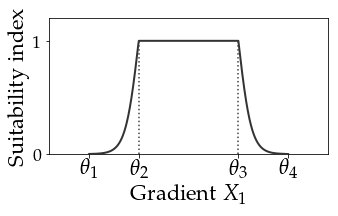
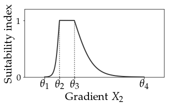

# SDMIT
Python scripts to develop and perform model identification

© 2017, Sacha Gobeyn (sacha.gobeyn@ugent.be or sachagobeyn@gmail.com). 

Details: Script can be run from a (I)python editor or command line. Designed for batch simulations
 
Publication: This code is coupled to a publication, it is advised to first read the publication.

Requirements (tested with):
  * Python 3.5.4
  
  * Numpy 1.13.1  
  
  * Pandas 0.20.3
  
  * Sklearn 0.19.0
  
Tested with Python 3.5.4 with [Anaconda 3 (64-bit)](https://www.continuum.io/downloads "Anaconda"))
on UBUNTU 16.04 LTS

Note: Should run cross OS

Support: Please feel free to open an issue in case of a problem.

Licensed under [ CC BY 4.0 Creative Commons](https://creativecommons.org/licenses/by/4.0/ "CC")

## Section 1: What can we do with SDMIT?

The species distribution model identification tool is a software tool based on machine learning that aims to train species distribution models with genetic algorithms. The implemented SDM is a habitat suitability model, aiming to define the relation 
of species response (here presence/absence) as a function of environmental gradients or feature. The genetic algorithm serves as an optimisation method performing:

1. Wrapped Feature selection: Searching for a set of input features which best describe observed presence/absence patterns (with parameters of species response curves have to be defined a priori).
                                                 
2. Embedded Feature Selection: Searching for a set of input features and parameter estimates which best describe observed presence/absence patterns.

3. Single or Multi-Objective Optimisation (SOO and MOO): Considering one (simple genetic algorithm) or more objective (non-dominated sorting genetic algorithm II, Deb, 2002) for the optimisation.
 
## Section 2: What kind of SDMs are we optimising?

The species distribution model currently implemented in the package is a simple SDM relating probability of species occurence to habitat suitability:


with 

 

and x, the input data for a number of features. The relation between SI and x is determined by a species response curve that is a gaussian-like topped of function ...



... or a skewed topped of function



In the encoding of the algorithm (see [settingsfile](settings.txt)), this logistic increasing and decreasing functions before and after the optimal range is indicated with the boolean **logit**. Turn logit of and we get linear curves. In mathematical terms the logit function is described by:


with 


Now the values of  representing the optimal and optimal range (see two example figures above). Now the values of SI for different features have to be combined to one HSI value and this can be done by choosing different aggregation functions (see string **interference** in [settingsfile](settings.txt)). For one you could take the minimum (**minimum**) ...


... or the mean (**mean**) ... 


... or the geometrix mean (**squaredproduct**), which could be considered as most adequate from a theoretical point of view ...


To finally determine species occurence one applies a threshold on the HSI (string or float **threshold** in [settingsfile](settings.txt)):


>So basically, the implemented species distribution model is a model relating habitat suitability to species occurence by means of a number of species response curves and a HSI threshold. What do we remember for the application of the model in SDMIT?
 >1. Set **logit** to **True** in the [settingsfile](settings.txt) file if you want logistic increasing and decreasing functions describing the suboptimal conditions for SI. If **False** then linear functions will be set.
>2. Select an interference/aggregation (**interference** in [settingsfile](settings.txt))) function to compute SI to HSI (**squaredproduct** or **minimum** or **mean**) in the *settings.txt*
>3. Select a value for the **threshold** in the *settingsfile.txt*. One can also decide to maximise (**max**) the threshold based on the TSS (i.e. thresholds will vary over the models being optimised).

## Section 3: How can we use this optimisation tool?

As mentioned above, these are a number of mode of actions. First you can choose if you want to do 'wrapper' or 'embedded' feature selection. The difference is quite easy, in the first one relies on the parameter estimation for  and does not ask the algorithm to change them to search for a good model. In case of the second, one asks the algorithm to also change the values of these parameters, so to find 'better' or more optimal solutions. In general, one would prefer the second approach, as the feature search can be influenced by the set parameter values. However, if one is very confident about the parameters (with help of expert knowledge), one can decide to use 'wrapper' feature selection. Now, the method implemented to facilitate both ways of model learning is based on genetic algorithms. We will not get into the details of this exaclty works, and go further the practical aspect:


>Choose in the [settingsfile](settings.txt) the **mode** (string)
>1. **variable**: Embedded feature selection
>2. **binary**: Wrapper feature selection
>That was easy, no?

Now we have defined what we want to identify, however, we also need to define what we want to optimise. Typically, this is a objective function based on a accuracy measure. Many measures are available (Mouton *et al.*, 2010), however, the true skill statistic is an often used statistic:


with (Sn = correct estimation of species presence, Sp = correct estimation of species absence):


with: 


So we can decide to maximise on TSS (single objective optimisation) or we could also optimise on both. Now, how would the latter work? It would mean we would have to optimise two criteria; the correct estimation of species presence, on the one hand, and species absence, on the other. However, the objective of optimising the two measures can be conflicting: SDMs that estimate species presence prefectly fail to estimate absence well and vice versa. Now, to identify this trade-off between objectives, specific algorithms are developed some time ago. Here, we use the non-dominated sort genetic algorithm II (NSGA-II) to identify the trade-off between Sn and Sp. Also here, the indication whether we want to choose for SOO or MOO are in the *setting.txt* file.


>1. If you want to do SOO, go to the *settings.txt* file and set **multi_objective** to False. Otherwise (MOO) set it to True.
>2. Choose you objective function **objective_function** in the *settings.txt* file, for SOO, this can be the TSS, Kappa, AUC, AIC, BIC or CCI (see Mouton *et al.*, 2010 for formulation). For MOO, one has to define multiple objectives and delimit them with a comma (e.g. 'Sn,Sp'). The current impementation has been tested for two objectives, but in practice should also work for three to four objectives.

Finally, there are a number of settings we need to define before we start the algorithm. Now, we could just use standard values for these 'hyper parameters', however, depending on how much time you have, you might want to tune these a bit, since one could end up with non-satisfying results when stopping the search algorithm to soon. Basically, we need to calculate a few things:

1. The number of algorithm iteration cycles.
2. The population size PS, the number of solutions are evaluated in one algorithm iteration cycle.
3. The mutation rate pm, determing the rate of random perturbations in the solutions (e.g. change a parameter value of  species response curve to a new random value).
4. The selection rate, determining how much solutions of an algorithm iteration cycle are copy-pasted to the next cyle, which we typically set to 0.5.
5. The crossover rate pc, determining how the solutions are 'combined' to new solutions (compare it with the concept of inheritance  from parents to offspring) which we can set to 1.

Now about the last two we don't really need to worry, however the first three are quite important since they interact with each other. Luckily, a smart guy, Matthew Gibbs came up with some guidelines to determine these three hyper parameters (Gibbs *et al.*, 2008) and it turns out that they work quite well. During my research, I did a number of tests and found them to work well. The guidelines:

1. Determine how much time you want the algorithm to run. You can calculate this with how long a fitness evaluation (a single SDM run) takes (for instance 0.1 second) and the time you have available (30 minutes = 1800 seconds), i.e. determine function evaluations by dividing the computer time available by the average time to compute the fitness function. Thus function evaluation is then - in this example - equal to 18000.

2. Solve next equation to find PS with M = 3 and l equal to 4 multiplied by number of variables (*for embedded feature selection!!!*) OR equal to the number of variables (*for wrapper feature selection*) (for l is 10, approximately a value of 50 is found for PS):


3. The mutation rate pm is equal to 5 divided by PS (in this example 0.1).

4. The (minimum) number of algorithm iteration cycles would then be equal to FE/PS (approximately 360 for N = 50 and FE = 18000).

> Compute an approximate value for the hyper parameters by using the [hyperparameters.py](scripts/hyperparameters.py) function. Set selection rate equal to 0.5, crossover rate equal to 1 in the *settings.txt*.

## Section 4: Let's try to get the code running

The Python code is developed in a way it can run as an executable by typing in command window 'python ./scripts/script.py parameterfile.txt'. As a consequence, the user interface is run by adapting text or csv file. At first hand this might seem like a bit of a struggle, however, when trying to move towards machine learning and uncertainty analysis on high performance platforms, this is a great advantage.

### Step 1: Prepare input files 

1. [input data file](inputdata_Baetidae.csv): a comma delimited file with columns ID, X, Y, date, taxon, abundance, variable and value. A coupled taxon-variable list format is used. X and Y can be the coordinates of the center of a pixel or the exact coordinates of the location. Make sure that the name of taxon and variable are the same in the files [considered variables](considered_variables.csv), [model parameters](parameters_Baetidae.csv)

2. [considered variables file](considered_variables.csv): a comma delimited file with columns variable, consider, name_sim and unit. With the column consider, one can switch (value 1 or 0) variables on/off that we want to consider in the optimisation. The column 'name_sim' should carry the same name for the variables considere in [input data file](inputdata_Baetidae.csv) and [model parameters](parameters_Baetidae.csv) and should contain normal characters (a-z, 1-9, no ',''s).

3. [model parameters file](parameters_Baetidae.csv): a comma delimited file with columns taxon, value (leave blank), type (always continuous), b1 to b4, low, high and a1 to a1. The a1 and a4 are the values for  and are an initial estimate by the user. The values for b1 to b4 are boundary values, with b1 and b2 bounding a1 and a2, and b3 and b4 bounding a3 and a4. Make sure the names of the variables match the column variable in [input data file](inputdata_Baetidae.csv) and name_sim in [considered variables file](considered_variables.csv)

4. [settings file](settings.txt): a file delimited by tabs indicating the settings for the model to run. A list of important settings are already reported above and all are summarized below:

| tag        | type | default   | explanation / notes |
| ---|:---:|:---:|---|
| nan_value   | float  | 100000000000000 | nan value used in computation objective function|
| multi_objective | boolean    | False      | SOO (False) or MOO (True) |
| objective_function | float | TSS     |    objective function used to optimise. If multiple objectives are used, then one has to delimit the objectives with a comma (e.g. Sn,Sp) |
| ncpu   | integer   | 1 | number of cpu's used to run algorithm, for all use '-1' 
| number_of_chromosomes | integer     | -      |   population size, see above (minimum eight) |
| maximum_runs | integer | -      |    number of iterations |
| stop_criterion  | integer    | - | number of iterations for which not improvement in the objective function has been observed |
| mutation_rate   | float  | -      | see above, between 0. and 1.   |
| crossover_rate | float | 1.0     |    see above, between 0. and 1. |
| selection_rate   | float   | 0.5 | see above, between 0. and 1. |
| duplicates     | boolean | True     |   only tested for True |
| mode | string | variable     |    wrapper feature (binary) or embedded feature (variable) selection |
| logit   | boolean   | True | logistic increasing and decreasing function (True) or linear (False) |
| interference  | string  | squaredproduct      |  interference between SI values from response curves (see Section 1)  |

5. [code parameter file](parameterfile.txt): a file delimited by tabs linking files together so [code](scripts/script.py) can run in command line. 

| tag        | type | explanation / notes |
| ---|:---:|---|
| inputdata   | string  | file name of csv containing inputdata |
| taxon | string     | name of taxon, make sure name is the same as in  [input data file](inputdata_Baetidae.csv) and  [model parameters file](parameters_Baetidae.csv) |
| variables | string  |   file name of csv containing considered variables for training |
| resmap   | string   | name of map where results are printed |
| settings | string      |   file with settings |
| model_parameters | string  |    file name of csv containing model parameters |
| full_output  | boolean  | True or False |


### Step 2: Run model

With the given example input files, we should be able to do a test run of the code. There are two options:

1. Run the model in command-line by going to the folder 'SDMIT/script.py' and typing 'python scripts/script.py parameterfile.txt'

2. Open your favorite IDE (spyder, pycharm, ..) and run script.py. It is important to note that script.py will only run in this mode if you use the correct name in the main function:

```python
if __name__ =="__main__":
 
    print("="*19)
    print("SDMIT (version 2)")
    print("="*19)    
    print(" CC BY 4.0 Creative Commons, sacha gobeyn, \n"+
          " sacha.gobeyn at ugent.be OR sachagobeyn at gmail.com")
    print(" https://github.com/Sachagobeyn/SDMIT \n https://github.com/Sachagobeyn/SDMIT/releases/tag/v2.0.0")
    print(" Reading parameterfile and code settings")
       
    "Read parameterfile"
    if len(sys.argv)>1: #in terminal
        arguments = read_parameterfile(sys.argv[-1])
    else: # in IDE
        arguments =  read_parameterfile("../parameterfile.txt")
    ..
```

### Step 3: Check results

In the results folder one can find three maps, with only optimisation results being usefull. Here, we can find the output files and results for every iteration (0 to number of iterations). In each of these files, we can find the considered variables and their parameter values (embedded feature selection) or in-/exclusion (wrapper feature selection) together with the values for different evaluation measures (CCI, AUC, Kappa, TSS, AIC, BIC, ..). Also a unique ID is found which refers to the model ID. If full_outputin the [code parameter file](parameterfile.txt) is True than we can find the model X in model_runs/X-parameters.csv as also the model run in X-model_run.csv

For now that is it! I will try to add specific instructions where needed, based on suggestions and comments!


## References:

Deb, K., Pratap, A., Agarwal, S., Meyarivan, T., 2002. A fast and elitist multiobjective genetic algorithm: NSGA-II. IEEE Transactions on Evolutionary Computation 6, 182–197.

Gibbs, M.S., Dandy, G.C., Maier, H.R., 2008. A genetic algorithm calibration method based on convergence due to genetic drift. Information Sciences 178, 2857–2869.

Mouton, A.M., De Baets, B., Goethals, P.L.M., 2010. Ecological relevance of performance criteria for species distribution models. Ecological Modelling 221, 1995–2002.
